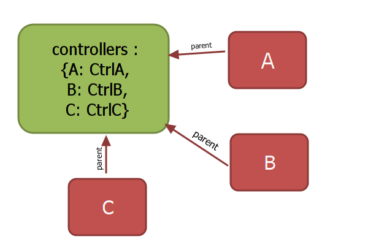

# Page

----

## 1、extend
讲到 **Page** 类的使用，就不得不提到 *extend* ，通过他我们可以方便地像 *Java* 使用 *类* 的概念扩展对象，举一个简单的栗子：
``` javascript
require('plugins/extend');

// 基类
var Person = Class.extend(function() {
	this.name = "";	

	// 构造函数，创建实例对象
	this.constructor = function(name) {
		this.name = name;
	};

	this.say = function() {
		alert(this.name);
	}
});

// 继承 Person 类
var Student = Person.extend(function() {
	this.say = function() {
		alert(this.name + " is studying.")
	}
});

var person = new Person("Tom");
person.say(); 	// "Tom"

var student = new Student("Jack");
student.say(); 	// "Jack is studying"
```

## 2、引用
``` javascript
var Page = require('core/page');
```

----

## 3、原理

查看我们以前做过的工程的页面，都可以分解成一个一个单独的操作（Action）。每一个操作，又能分解成 **3** 个单独的步骤：
```flow
st=>start
load=>operation: load（加载）
submit=>operation: submit（提交）
close=>operation: onClose（关闭）
e=>end

st->load->submit->close->e
```
并不是每一个操作都能完整对应到这3个步骤，但是这3个步骤能完整对应所有的操作。通过继承**Page**基类，重写方法完成业务特殊的页面控制器

```javascript
define(function(require) {
	require('plugins/extend');
	var Page = require('core/page');
	
	// 我的页面
	var MyPage = Page.extend(function() {
		
		// 加载时弹出信息
		this.load = function() {
			alert("I am here");
		};
	});

	return MyPage;
});
```

----

## 4、初始化
使用页面控制器首先对其实例化

```javascript
// new Page(id, panel)
// @params id 页面ID，唯一确定
// @params panel 页面对象，可不传
var page = new MyPage('centit', panel);
```

实例化完后就可以调用对象的 *init(panel, data)* 方法

``` javascript
// 无参数调用
page.init();

// 有些对象在实例化时无法确定panel或者panel每次调用时都发生变化，可以在这里再次传入
page.init(panel);

// 传入数据data供控制器使用
page.init(panel, data);
```

上面3中方法都可以使用，调用 *init()* 方法后内部将自动调用对象的 *load()* 方法。

----

## 5、控制器的嵌套
在页面中难免存在嵌套的情况，比如列表页面中点击按钮打开编辑对话框。对话框页面相对于列表页面就是子页面，对话框控制器相对于列表控制器就是子控制器。

``` javascript

// 子页面控制器，或者通过require获得
var DialogPage = Page.extend(function() {

});

var MyPage = Page.extend(function() {

    // 注入子控制器
    this.injecte([
		new DialogPage('dialog')
	]);
});
```

注入后，父控制器和子控制器会自动插入一些属性确保联系。在父控制器中的 **controllers** 对象会增加子控制器，在子控制器中 **parent** 对象指向父控制器：



