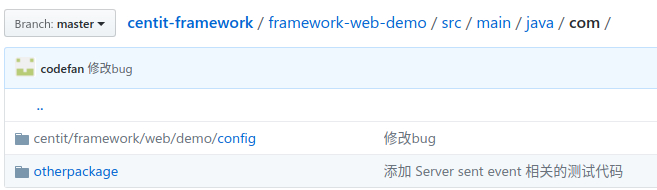

[南大先腾](http://www.centit.com/)一直注重在技术领域的研发投入，公司2008年成立基础研发部（现改名为技术管理中心），公司目前有300人，其中研发人员200余人，技术管理中心有30多人，占研发团队的15%。

“诚信、敬业、高效、共享”是南大先腾的企业文化。“共享”不仅仅是企业内部共享经营成果，还表示南大先腾愿意与技术领域的同仁共享技术研发成果。技术管理中心从2016年启动了开源计划，将公司技术应用经验、基础研发平台、研发工具等等从行业业务中剥离出来，并在[https://github.com/ndxt](https://github.com/ndxt)上开源，文档参见[https://ndxt.github.io/](https://ndxt.github.io/)。 任何个人或企业都可以免费使用。

框架的更新列表参见 [大事记、更新与发布](/UPDATE_LOG.md);框架jar包发布在[Maven Central](http://central.maven.org/maven2/com/centit/)库中。

开源项目介绍[参见项目列表](/projects/)。

## 框架目标

南大先腾框架平台并尤其说是一个技术框架平台不如说它是一个业务框架平台。我们说框架是一个高层设计，所以框架必须有一个目标，**先腾框架平台的目标就是为行业应用软件开发节约成本。**框架的适用范围定位在企业、学校、医院、政府等机构内部的办公系统。框架的核心思想包括：

1. **通过确定技术选型来营造一个共同的学习氛围，增进开发人员交流同事也减小团体人员变动的成本。**框架选择的技术都是非常知名的开源平台，比如spring mvc，spring security 等等。同时为了兼顾开发人员的习惯，框架并没有绑定到一个具体的技术，比如持久化可以选择spring jdbc，MyBaits或者hibernate都是主流的框架，框架只是做了建议使用jdbc，因为框架对jdbc做了jpa的封装，这样用起来跟灵活也大大减少了编码量。
2. 框架的一个最有重要的工作就是定义了前后端的通讯数据格式、Session中的数据格式、组织机构和权限管理的框架。**这个是框架唯一强行要求遵循的规范**，这个规范使用接口的形式规定的，并没有绑定到持久化的数据结构；框架对这个接口有多种实现，有json格式、关系数据库和远程调用框架中集成平台服务的，开发人员也可以用和业务更贴切的方式自行实现。**遵循这个规范开发的项目可以非常容易（零开发，一般只要简单的配置）的和框架中其他服务、组件进行集成**。
3. **框架**中的commons工程，通过将我们开发过程中经常用到的算法进行封装来减少开发。注意：我们强力推荐使用Apache 的commons中的算法，只是在找不到现成的算法才在我们的commons中查找或者添加，**不建议在业务系统中编写任何和业务无关的算法**。
4. **框架将组织机构、功能权限、数据范围权限、数据服务、操作日志等等通用的功能抽象出来，让开发人员只关心业务实现。**
5. **框架**开发的一个**重点工作就是开发各种小的功能服务程序**，比如：文件服务、即时通讯服务、统计报表服务、工作流服务等等。这些可以任务一个粒度更大的功能封装，这样可以为业务开发节省大量的时间。

## 版本说明

因为框架本身的不成熟且迭代比较快，所以框架的版本一直在更新，框架的版本号有一下约定。  
  1. 版本号格式为 （主版本号）.（次版本号）\(-SNAPSHOT 或者 .修订号）。比如 1.1-snapshot ， 1.1.1710。  
  2. 主版本号如果有变化表示前后不兼容，就是无法用脚本、程序进行自动的升级。如果需要升级必须要大量的人工操作，比如将底层struts2换成了spring mvc、jsp换成完全前后端分离的方式。  
  3. 次版本号的变更（主版本号相同），适用于可以使用脚本进行升级，或者只要少量的规则性人工操作就可以完成版本迁移（升级）。  
  4. 修订号，主要是修改一些bug或者添加一些新特性。修订号为年月，如1801表示18年1月。  
  5. 框架开发过程中都使用snapshot版本。  
  6. 项目开发过程中可引用框架的snapshot版本也可以引用发行版本，但是项目一旦在正式环境部署后一定要使用发行版本。

## 版权说明

南大先腾所有开源项目采用[The Apache License, Version 2.0](http://www.apache.org/licenses/LICENSE-2.0.txt)授权协议。

## 交流与服务

1. 发现框架有bug或者对框架有建议可以直接在github的项目中以issue的方式提交，比如 [https://github.com/ndxt/centit-framework-system/issues](https://github.com/ndxt/centit-framework-system/issues) 。
2. 先腾提供框架交流群，这个群是先腾提供的一个交流平台，不是服务平台，所以我们不承诺一定会回复您的问题。加群验证词为：“我对先腾框架很有兴趣希望加群交流”；群号：344548623，二维码：
   。
3. 如果您所在企业想使用先腾框架（使用框架是免费的，但是要遵循Apache License 2.0）并且希望得到专有的服务请联系框架交流群的群管理员。    

## 快速入门

### 框架整体介绍

框架实现了系统管理、权限体系、数据服务等等业务系统通用的部分，开发人员进行系统开发时可以不考虑这些业务无关的内容。基于公司框架可以开发多种类型的应用系统。

1. 开发一个传统的但应用系统，但应用系统就是只有一个工程结果只打一个war包，单独部署的系统；这样的系统有包括后台系统管理和前段业务应用。github的[centit-framework-system](https://github.com/ndxt/centit-framework-system)中有一个[framework-system-demo](https://github.com/ndxt/centit-framework-system/tree/master/framework-system-demo)模块就是一个最简明的示例。这个示例可以直接运行，其中包括了系统管理的所有实现。但依然有一下几个方面需要开发人员根据项目的情况进行修改：
   
   * 数据库的选择，目前支持MySql，Oracle，H2和SQLServer。每种数据库示例中都有对应的flyway自动初始化脚本。开发人员只需要在resources目录中的system.properties文件中定义即可。
   * 数据持久化的技术选型，目前框架无差别的实现了SpringJdbc、MyBatis和Hibernate三个版本，开发人员需要在pom.xml中修改对应的依赖，依赖有两个包一个具体的逻辑实现还有一个是配置类，同时还需要在demo的config中修改配置类的应用。强力推荐使用SpringJdbc，jdbc较为灵活，并且框架用jdbc对jpa做了最基础的实现，使用更加便。
   * 为了是示例执行简单，demo把前段打包成[framework-system-view-easyui](https://github.com/ndxt/centit-framework-system/tree/master/framework-system-view-easyui)引入项目中，这样可以使用web容器（比如：Tomcat）直接运行；但是框架是基于前后端分离的思想设计的，这个jar包中只有静态的文件，将这个jar解压到前段项目中，采用前后端分离的方式开发。前段单独部署到Nginx或者Apache这样的http服务器中。
   * 虽然是但应用系统的开发方式，它依然可以用框架提供的各种功能服务产品。这些工具类功能服务产品都有一个核心包，可以通过引入这些核心包将功能服务产品直接整合到项目中。比如文件服务器的整合方式为可以参见[https://github.com/ndxt/centit-fileserver/tree/master/fileserver-demo/src/main/java/com/centit/fileserver/demo/localstore](https://github.com/ndxt/centit-fileserver/tree/master/fileserver-demo/src/main/java/com/centit/fileserver/demo/localstore) 。 
2. 开发分布式系统项目。框架提供了一个集成平台[centit-integration-platform](https://github.com/ndxt/centit-integration-platform)；这个平台提供了同意的系统后台管理和基础数据服务平台，并提供了服务接口。各个业务模块只要应用服务接口就可以开发成可以集成在一起的，独立部署的分布是业务系统。业务模块开发的示例代码参见[centit-ip-app-demo](https://github.com/ndxt/centit-integration-platform/tree/master/centit-ip-app-demo)。这些独立部署的业务通过单点登录平台[centit-cas](https://github.com/ndxt/centit-cas)集成在一起。这样的分布式系统有以下缺点：
   * 各个业务模块只能和集成平台之间进行数据交换，如果不同的业务模块之间需要互相调用需要显式的实现接口，并且需要知道对方的部署位置。
   * 在不借助第三方工具的情况下各个业务模块只能部署一个副本，接口调用不能做负载均衡。
   * 这样做的额主要意义是为了模块之间独立，避免互相干扰，并且可以用不同的技术栈来实现。主要应用场景是服务与性能要求不高，但是业务非常庞大和复杂的系统。比如：政府内部的业务系统，这也是南大先腾最典型的目标客户。
3. 基于spring cloud 的分布式系统项目。框架的设计理念和spring boot 非常相像。不同的是spring boot重点是集成各个技术平台，先腾框架的重点是实现业务系统共有属性。先腾框架中的工程业务部分和配置部分都是分离的，所以将业务实现部分可以直接集成到spring cloud中，来实现基于spring cloud的分布式系统。[centit-integration-platform](https://github.com/ndxt/centit-integration-platform) 的spring cloud的版本是 [centit-framework-cloud](https://github.com/ndxt/centit-framework-cloud)。[framework-cloud-demo](https://github.com/ndxt/centit-framework-cloud/tree/master/framework-cloud-demo) 是基于spring cloud开发的业务模块示例代码。
4. 开发工具类项目。这类项目通常比较小，并且不需要复杂的组织架构和权限体系的维护，甚至不需要数据库进行持久化，只是要实现一个具体的功能，比如：文件服务器。[framework-web-demo](https://github.com/ndxt/centit-framework/tree/master/framework-web-demo)就是一个最基本的示例代码。开发人员需要注意一下几点：
   * 这个示例代码中的所有组织架构、权限等等配置信息都写在json文件中，用户除了可以修改密码，其他的都只能通过修改配置文件来修改。
   * 项目中没有数据库持久化部分，开发人员可以根据需要从[**centit-persistence**](https://github.com/ndxt/centit-persistence)中选这持久化基础包。

框架通过接口[PlatformEnvironment](https://github.com/ndxt/centit-framework/blob/master/framework-core/src/main/java/com/centit/framework/model/adapter/PlatformEnvironment.java)来屏蔽了系统组织机构、权限体系和数据服务的具体实现。**所以对开发具体的业务模块来时，无论上面的那种方式，具体的开发都是一样的。框架可以通过修改依赖的包和配置信息来切换发布方式，所以强力建议业务开发人员都基于**[**framework-web-demo**](https://github.com/ndxt/centit-framework/tree/master/framework-web-demo)**来开发业务模块，这样做无论集成和调试都最为便捷。这个也先腾框架最核心的价值。**每个Demo项目我们应该关注pom.xml文件中的依赖和config中的配置类。他们的差别就是不同的jar包的组装，体现在对PlatformEnvironment接口的不同实现。

### 新建项目

首先新建一个基于maven的空项目，复制[framework-system-demo](https://github.com/ndxt/centit-framework-system/tree/master/framework-system-demo)中代码到自己的项目中。

1. 修改代码的包名


代码com.centit.framework.web.config这个包中的类为配置类，参见[启动与系统配置](./system_design/product_design.html#启动与系统配置)，这个包的名称也可以根据业务进行修改。

包otherpackage中放业务代码。

2. 修改配置文件

  * 配置文件system.properties，配置文件中有说明。
  * static_system_config.json 文件中可以维护框架所需的基本元素。可以在开发时维护自己所开发的页面，最终应该维护到数据库中或者集成平台中。

### 给项目添加持久化模块

框架提供多种[持久化方案](./system_design/technical_design.html#数据持久化)，推荐使用jdbc方案，下面的示例都是以jdbc方案为例介绍的，其他方案类似。

1. 添加持久化包依赖
```xml
<dependencies>
    <!-- 添加持久化框架包和对应的配置类包，推荐jdbc 也可以使用 hibernate或者mybatis-->
    <dependency>
        <groupId>com.centit.framework</groupId>
        <artifactId>centit-persistence-jdbc</artifactId>
        <version>${centit.persistence.version}</version>
    </dependency>
    <dependency>
        <groupId>com.centit.framework</groupId>
        <artifactId>centit-persistence-jdbc-config</artifactId>
        <version>${centit.persistence.version}</version>
    </dependency>
    <!-- 添加数据库jdbc驱动包，根据项目实际情况添加-->
    <dependency>
        <groupId>mysql</groupId>
        <artifactId>mysql-connector-java</artifactId>
        <version>${mysql.version}</version>
        <scope>runtime</scope>
    </dependency>
</dependencies>    
```
2. 添加数据源配置信息，在system.properties添加jdbc链接信息。

3. 添加持久化配置信息

```java

@Configuration
@Import({JdbcConfig.class /*添加jdbc配置类*/,......})
@ComponentScan(basePackages = {"com.centit","com.otherpackage"},
        excludeFilters = @ComponentScan.Filter(value = org.springframework.stereotype.Controller.class))
public class ServiceConfig {
    
}
```
### 新建模块
1. 添加po类
  * po为和数据库表一一对应的类，通过jpa注解来实现映射关系（Mybatis方案不需要jpa注解）。
  * 框架还采用了hibernate-validator对字段进行合法性验证。
  * centit-persistence-jdbc对jpa进行了强化添加了字段自定义生成规则，通过注解ValueGenerator，可以用来生成主键、当前时间或者气他字段的运算结果等等。
  * 如果是逻辑删除的类需要实现EntityWithDeleteTag接口。这样就可以让系统自动处理逻辑删除了。
  * 对数据字典字段添加DictionaryMap注解，实现数据字典值转json时自动映射。
2. 添加dao类。
  * dao类扩展BaseDaoImpl基类就可以实现简单的增删改查操作。
  * 在 getFilterField 方法中编写查询条件中的变量和过滤条件的对应关系，可以实现sql语句的自动拼装。
3. 添加service类
  * service类是控制数据库事务的地方，所以接口和实现一定要分开。
  * 接口可以扩展BaseEntityManager接口，实现增删改查操作。业务系统也可以不从这个接口扩展，自己写基本的操作接口。
  * 实现了对应的扩展BaseEntityManagerImpl类，自动实现BaseEntityManager中的方法。
4. 添加controller类
  * controller需要继承BaseController类，这个基类中实现了当前用户的信息获取和查询条件整理工作。
  * 服务通过restful风格的url加上json格式的返回数据实现，参见[前后端数据通讯格式](./system_design/technical_design.html#前后端数据通讯格式)。
5. 添加前端页面
  * 由于前后端分离，所以前段界面全部用html + ajax请求的方式实现。
  * 前端页面每个模块一个文件夹，所以的js请求代码通过放在ctrl子文件中。
### 其他说明

在信息管理系统或则OA类等先腾的典型业务中的功能模块都会应对到数据库中的一个业务主表；在项目中就会对应一套从数据库存储、业务逻辑实现到和前段界面的交换的代码；参见[MVC分层设计和脚手架](./system_design/technical_design.html#mvc分层设计和脚手架)一节。系统需要对业务模块进行权限管理，所以每一个业务木块都要有一个标识、每一个方法可以用一个url和http请求方法来标识，请参见 权限体系 一节。数据范围权限的控制需要通过 sql来控制数据的访问，请参见[参数驱动SQL](./system_design/technical_design.html#参数驱动sql)一节。 框架提倡前后端分离的方案，前段通过ajax请求后端，后端通过类restful风格方式提供数据服务，请参见[前后端数据通讯格式](./system_design/technical_design.html#前后端数据通讯格式)一节。

